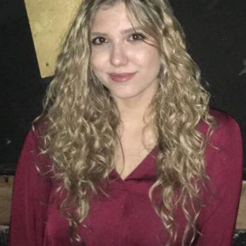

# Andela Stefanovic
 *** ******, Storrs, CT 06269  
 ***-***-****  
 andela.stefanovic@uconn.edu  
 https://www.linkedin.com/in/andela-stefanovic/  

# Summary
 Currently a student at the University of Connecticut, finishing dual degree in Computer Science and Engineering, with a specialization in cybersecurity and minor in mathematics, and Geographic Information Science. Expected graduation date is May 2023.

# Education
**University of Connecticut, Storrs, Connecticut**  
_Bachelor of Science and Engineering, Expected Graduation Date: May 2023_
* **Relevant Coursework**: Computer Architecture, Discrete Systems, Systems Programing, Cybersecurity Lab, Computer Networks and Data Communication, Algorithms and Complexity, Computer Security, Modern Cryptography, Fundamentals of Spatial Database Systems,
* **Honors & Awards**: IDEA Grant Recipient (April 2021), Undergraduate Fellowship in Sustainable Energy (May 2021)
* **Clubs**: Artificial Intelligence Club (help found the club, secretary for 4 years), Beekeeping Club (president), International Student Advisory Board

# Work Experience
## University of Connecticut (Storrs, Connecticut)
**Student Researcher for a UConn-based STEAM project** (_May 2020 - Present_)  
Working under Material Science and Engineering Department on creating a Solar Tree at the University.  

- Working on solar cells and solar panels
- Working on Social Media Team
- Created and maintained website for the project

**Student Supervisor at UC Cafes** (_September 2018 - Present_)  
- Supervised, trained and developed team members in accordance with company
policies and procedures.
- Motivated and disciplined employees according to established requirements.
- Provided instruction, coaching, and motivation to all employees.

# Additional Skills
* Languages: Serbian (native), English (Fluent), German (Advanced)
* Programming languages: Python, C, C#, C++, Java, PHP, SQL, Scheme, Pascal
